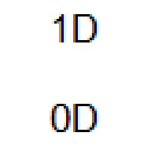

# Curso Jogo 1D\_0D — Aprenda a Jogar Minijogos Inéditos

## 

---
1. **Apresentação do Instrutor**: Sou Eduardo de Quadros, um autista brasileiro, nível 1 de suporte, graduado em Ciência da Computação em dezembro de 2021 e graduando em Marketing Digital, com previsão de conclusão para dezembro de 2025. Neste curso, ensinarei a jogar o jogo eletrônico que criei, chamado ***1D\_0D***.
2. **Classificação Etária Livre**: O jogo tem classificação etária livre. Muitos jogadores, mesmo adultos, preferem jogos sem restrições de idade.
3. **Preço do Curso**: O curso custa **R$ 5,00 por semana** (**preço líquido**). No **Kirvano**, o **preço bruto** é de R$ 7,60 por semana, considerando a taxa percentual de 7,49% e a taxa fixa de R$ 2,00. Optei por cobrar uma *assinatura semanal* porque os alunos geralmente esquecem pequenos detalhes dos jogos e se beneficiam ao jogá-los repetidamente todas as semanas.
4. **Duração Livre do Curso**: O curso **não tem data de término**. Os alunos podem permanecer matriculados pelo tempo que desejarem.
5. **Certificado do Curso**: O curso tem duração livre, portanto **não oferece certificado**.
6. **Provas do Curso**: O curso **não aplica provas** aos alunos em nenhum momento.
7. **Progresso do Aluno no Curso**: O curso **não apresenta progresso percentual** concluído do aluno, pois a duração é livre. A ordem de ensino dos conteúdos é variável; não importa a sequência em que os conteúdos são ministrados.
8. **Período de Férias**: Anualmente, o curso estará de férias **de 1º de agosto a 30 de novembro**. Mesmo durante esse período, a *assinatura semanal* continuará sendo cobrada.
9. **Entrada de Novos Alunos**: Novos alunos podem ingressar na turma a qualquer momento, independentemente do número atual de inscritos.
10. **Plataforma de Videoconferência**: Utilizo o Google Meet para as aulas. Minha câmera no Google Meet não é apenas a webcam do meu notebook; uso a *câmera virtual* do programa *OBS Studio*, que exibe simultaneamente minha webcam, a tela do jogo e um monitor de teclas pressionadas do teclado em tempo real.
11. **Público-Alvo**:
	1. Não é necessário ter conhecimento prévio sobre jogos eletrônicos, basta gostar de jogos e querer aprender. O curso é voltado para **ambos os gêneros**, com a faixa etária **entre 14 e 38 anos**.
	2. O curso atrai pessoas com os seguintes **interesses**:
		1. **Jogos eletrônicos simples e inéditos**: O jogo combina mecânicas básicas (como pressionar a tecla espaço) com experiências sonoras e visuais únicas, atraindo jogadores casuais e entusiastas de jogos minimalistas.
		2. **Acessibilidade e inclusão**: O curso oferece adaptações para pessoas com deficiências físicas, cognitivas ou sensoriais, além de considerar necessidades específicas de idosos, crianças e mulheres que lidam com bebês.
		3. **Entretenimento lúdico e educativo**: Os minijogos podem ser usados como ferramentas de aprendizado ou relaxamento, atraindo educadores ou pais que buscam atividades recreativas para crianças.
		4. **Exploração de sons e design de jogos**: Interessados em design de jogos simples, efeitos sonoros criativos e experiências imersivas podem se beneficiar do curso.
		5. **Interação social**: A dinâmica do grupo no *WhatsApp* e as aulas semanais no Google Meet proporcionam uma experiência comunitária, ideal para quem busca interação social online.
	3. O curso resolve diversas ***dores*** dos potenciais alunos, incluindo:
		1. **Falta de acessibilidade em jogos eletrônicos**: Muitos jogos não são adaptados para pessoas com deficiências físicas, cognitivas ou sensoriais. Este curso oferece soluções específicas para esses públicos.
		2. **Dificuldade em encontrar atividades inclusivas para toda a família**: O curso permite que crianças, adultos e idosos participem juntos, com adaptações para diferentes idades e necessidades.
		3. **Necessidade de lazer acessível e de baixo custo**: Com um preço de R$ 5,00 por semana, o curso é acessível financeiramente e oferece uma rotina de lazer sem grandes investimentos de tempo ou dinheiro.
		4. **Estresse ou monotonia no dia a dia**: Os minijogos, especialmente os em 0D, oferecem experiências relaxantes e divertidas, ajudando a aliviar o estresse.
		5. **Desafios de inclusão social**: O grupo do *WhatsApp* e as aulas no Google Meet proporcionam um ambiente acolhedor para pessoas que podem se sentir isoladas, como idosos ou neurodivergentes.
		6. **Dificuldade em aprender novas habilidades tecnológicas**: O curso é projetado para pessoas sem conhecimento prévio em jogos eletrônicos, tornando-o acessível para iniciantes.
		7. **Falta de tempo disponível na semana**: Muitas pessoas têm agendas ocupadas e pouco tempo para atividades extras. O curso resolve isso ao oferecer apenas 30 minutos semanais de aula, aos domingos à tarde (*UTC-3*), permitindo que todos participem sem comprometer suas rotinas diárias.
	4. Para participar, você precisa ter um computador com ***Windows 10*** ou ***Windows 11***. Caso utilize Linux ou macOS, baixe o <a href="https://www-virtualbox-org.translate.goog/wiki/Downloads?_x_tr_sl=en&_x_tr_tl=pt&_x_tr_hl=pt-BR&_x_tr_pto=wapp" target="_blank" rel="noopener">***VirtualBox***</a> (da *Oracle*) e crie uma **máquina virtual** com *Windows 10* ou *Windows 11*. Recomenda-se usar a opção *Dinamicamente Alocado* (e não *Tamanho Fixo*), para evitar reduzir a capacidade total do seu disco rígido (*HDD* ou *SSD*). É importante destacar que, ao utilizar o *VirtualBox*, o usuário não precisa que a máquina física atenda aos requisitos mínimos do sistema operacional usado dentro da *máquina virtual*. Por exemplo, mesmo que a máquina física use *Windows Vista* e não tenha os recursos necessários para rodar *Windows 10* nativamente, ainda assim é possível instalar e executar o *Windows 10* dentro do *VirtualBox*. Se você não tem computador e utiliza apenas celular (Android ou iPhone), infelizmente não poderá se inscrever no curso. Você pode morar em qualquer país, mas é essencial **falar fluentemente o português**, pois **o jogo e as aulas são conduzidos nesse idioma**. O curso acontece **aos domingos, das 15:30 às 16:00 (*UTC-3*), *sem intervalos***. Independentemente do *fuso horário* do seu país, é importante ajustar seus horários de sono. Por exemplo:
		1. Se o curso ocorrer das 3:30 às 4:00 no seu *fuso horário*, você precisará dormir às 18h e acordar às 3h (9 horas de sono).
		2. Se o curso ocorrer das 23:30 às 0:00, você precisará dormir às 18h, acordar às 23h, voltar a dormir à 1h e acordar às 5h (também 9 horas de sono).
	5. Eu dou a carga horária de 30 minutos semanais para a turma, porque, para usuários pessoais do Google com o **plano gratuito do *Google One***, o *Google Meet* permite, no máximo, 60 minutos de aula quando ela não é individual (ou seja, quando tem mais de duas pessoas participando ao mesmo tempo).
12. **Grupo do *WhatsApp* da Turma**: Antes de iniciar o pagamento da *assinatura semanal*, o aluno deve entrar no <a href="https://chat.whatsapp.com/KIV0LnZa0ny7XjD3f2mOIn" target="_blank" rel="noopener">grupo do *WhatsApp*</a>. Todos os membros podem enviar mensagens, ver quem está no grupo e adicionar novos membros. No entanto, apenas eu posso editar as configurações do grupo.
13. **Convidados**: Você pode convidar quantas pessoas quiser para o curso, mas cada pessoa (incluindo você) deve pagar sua própria *assinatura semanal*. **Não há divisão de pagamentos**.
14. **Pausas Durante as Aulas**: Os alunos podem se ausentar temporariamente para ir ao banheiro ou beber água. Basta avisar, **sem necessidade de formalidades**.
15. ***Inassiduidade* do Aluno**: Considero *inassíduo* o aluno que falta a uma aula, entra mais tarde ou sai mais cedo. *Inassiduidades* ocasionais são aceitáveis, mas habitualmente isso não será tolerado. Para cada *inassiduidade*, o aluno deve me avisar com 15 segundos de antecedência, informando o motivo.
16. **Desistência Livre do Aluno**: Caso um aluno deseje desistir do curso, deverá me avisar com 15 segundos de antecedência, informando o motivo. Não é necessário avisar com 3 meses de antecedência, exceto nos casos em que haja um contrato formal entre os pais do aluno e eu, conforme o Código de Defesa do Consumidor do Brasil. Ao desistir, cancelarei a *assinatura semanal* do aluno na plataforma **Kirvano** e ele **não poderá mais participar das aulas**. Entretanto, a qualquer momento posterior, se o aluno desejar retornar ao curso, ele poderá fazê-lo, retomando sua participação nas aulas, a *assinatura semanal* e o grupo do *WhatsApp*.
17. **Crianças no Curso**: Você pode convidar crianças para participar, e elas não precisam pagar a *assinatura semanal*. No entanto, você, como responsável, deverá arcar com a assinatura tanto para si quanto para a criança.
18. **Banimentos do Grupo do *WhatsApp***: Membros que falem em outros idiomas que não sejam o português, membros que abordem assuntos fora do escopo do curso, membros que usem xingamentos ou palavrões nas mensagens, membros que demonstrem preconceito (racismo, etarismo, capacitismo, machismo, misandria, religiosofobia, xenofobia, homofobia, etc.) ou membros que pratiquem *flood* (comportamento de enviar repetidamente a mesma mensagem ou mensagens muito semelhantes com intervalo menor que **15 minutos**) serão banidos do grupo.
19. **Dica para o *Não-Flood* no Grupo do *WhatsApp***:
	1. Muitos membros do grupo não sabem que é possível editar mensagens já enviadas no *WhatsApp*, e tentam corrigir erros copiando a mensagem, digitando a versão editada, reenviando e apagando a antiga. Esse método causa *flood* e, por isso, o membro será banido do grupo. O **método correto e padrão** para editar uma mensagem no *WhatsApp* sem *floodar* é:
		1. Toque e segure a mensagem que você deseja editar.
		2. Toque nos **três pontos verticais** no canto superior direito da interface do grupo do *WhatsApp* (sem demorar muito tempo após o envio).
		3. Selecione a opção **Editar**.
		4. Faça as alterações necessárias e toque em **Enviar**.
	2. Este é o único método válido para editar mensagens no WhatsApp e evitar o *flood*. Utilize-o sempre que precisar corrigir algo após enviar uma mensagem.
20. **Quando um Aluno Sai do Grupo do *WhatsApp***: Se um aluno sair do grupo voluntariamente ou for banido, cancelarei sua *assinatura semanal* no **Kirvano**. O aluno não poderá participar das *aulas subsequentes*. Caso tenha saído por engano, poderá retornar ao grupo usando o link de convite disponível na página de vendas do curso no **Kirvano**.
21. **Grupo Lotado do *WhatsApp***: O *WhatsApp* permite até 1.024 membros por grupo. Caso o primeiro grupo atinja o limite máximo, criarei um segundo grupo para a mesma turma. Durante as aulas, ambos os grupos estarão conectados.
22. **Sistema de *Feedback* Contínuo**: Depois de cada aula, os alunos poderão enviar ***feedbacks***, no grupo do *WhatsApp* da turma, sobre o conteúdo apresentado e sugerir melhorias para as próximas aulas. Esse sistema permite que o curso seja constantemente atualizado e adaptado às necessidades dos alunos.
23. **Descrição do Jogo Eletrônico**: O jogo *1D\_0D*, desenvolvido para computadores *Windows*, é uma coleção inédita de **18 minijogos** criados por mim utilizando a engine *Godot*. Cada minijogo oferece uma *experiência única* com gráficos unidimensionais e adimensionais, acompanhados por efeitos sonoros envolventes. Um jogo em **1D** possui gráficos unidimensionais, com uma cor de fundo e apenas linhas horizontais centralizadas verticalmente na tela, com espessura de 1 pixel. Cada minijogo em 1D tem condições de vitória e derrota, além de efeitos sonoros específicos para início, vitória e derrota. Alguns minijogos em 1D possuem apenas esses três efeitos básicos, enquanto outros incluem efeitos adicionais que complementam a jogabilidade. A área de cada minijogo em 1D é representada por uma linha preta. Um jogo em **0D** possui gráficos adimensionais, com uma parte visual limitada a uma cor de fundo específica para cada minijogo. Não há elementos visuais além da cor de fundo, mas o foco está nos controles e sons. O objetivo é pressionar a *tecla espaço* para ouvir aleatoriamente 6 efeitos sonoros diferentes. Após ouvir todos os efeitos, a ordem muda aleatoriamente, permitindo que o jogador os escute novamente. Nenhum minijogo em 0D tem **condições de vitória ou derrota**. O minijogo só termina se o jogador ficar 5 segundos sem pressionar espaço e sem ouvir nenhum efeito sonoro nesse período. Nos minijogos em 1D, assim como nos minijogos em 0D, o único controle disponível é a *tecla espaço* do computador. Porém, enquanto em 1D a função dessa tecla depende do minijogo específico (podendo interagir com elementos visuais, alternar estados ou ativar ações únicas durante a partida), em 0D, a *tecla espaço* tem sempre a mesma função: tocar um efeito sonoro aleatório dentre 6 disponíveis.
24. **Como é o Jogo**: O jogo consiste em **18 minijogos** (9 em 1D e 9 em 0D), todos desbloqueados por padrão. O jogador não precisa vencer um minijogo para acessar outro. O minijogo mais longo tem um **detonado** que dura no máximo 22 minutos.
25. **Jogabilidade no Computador do Aluno**: Sim, você pode jogar o jogo no seu computador, mesmo fora do horário das aulas.
26. **Sugestões de Novos Minijogos**: Como aluno, você pode sugerir novos minijogos em 1D ou 0D para serem criados e lançados em versões futuras do jogo. Envie-me a descrição do novo minijogo que deseja criar. Desenvolverei cada sugestão em um projeto separado da *Godot* e, após finalização, adicionarei o minijogo ao projeto principal.
27. **Sugestões de Conquistas para os Minijogos**:
	1. Os alunos podem sugerir novas conquistas (selos ou troféus) para os minijogos já lançados na versão mais recente do jogo. Cada conquista deve ser criada com os seguintes elementos:
		1. **Imagem de Ícone da Conquista**: A imagem pode ser criada pelo próprio aluno, por um freelancer gratuito ou pago contratado, ou gerada por inteligência artificial. A cor de fundo do ícone determina o nível de dificuldade da conquista:
			1. Verde — Facílimo
			2. Roxo — Fácil
			3. Amarelo — Normal
			4. Azul — Difícil
			5. Vermelho — Dificílimo
		2. **Título da Conquista**: Um nome curto e descritivo que represente a conquista.
		3. **Descrição da Conquista**: Uma frase no imperativo (afirmativo ou negativo) que descreva o objetivo da conquista. Exemplos incluem “Derrote todos os inimigos.” ou “Não pressione espaço por 10 segundos.”.
	2. O armazenamento das conquistas é **local**, e se o jogador limpar o *cache* do jogo, todas as conquistas serão perdidas e precisarão ser obtidas novamente. As sugestões recebidas durante um período de 3 meses, desde o momento da primeira sugestão, serão implementadas no projeto da *Godot* e lançadas na próxima atualização do jogo. Após cada atualização, um novo período de 3 meses começa para receber novas sugestões, garantindo que o jogo evolua continuamente com base nas contribuições dos alunos.
28. **Sugestões de Traduções para o Jogo**:
	1. Os alunos podem sugerir traduções para expandir o jogo para novos idiomas.
	2. Atualmente, o jogo está disponível nos seguintes idiomas:
		1. Português brasileiro
		2. Inglês australiano
		3. Espanhol mexicano
		4. Alemão austríaco
		5. Francês da França
	3. Meu sonho é traduzir o jogo para os seguintes idiomas:
		1. Italiano da Itália
		2. Holandês
		3. Polonês
		4. Indonésio
		5. Dinamarquês
	4. No entanto, aceito sugestões para qualquer outro idioma que o aluno domine. Se um aluno souber traduzir todos os textos da versão mais recente do jogo para um idioma específico, ele pode escrever a tradução e me enviar. O preço máximo que estou disposto a pagar por cada tradução completa é de **800 reais**. Contudo, se o aluno for alguém que **me ama muito (amor de amizade) há mais de 2 anos** e a tradução de documentos ou vozes **não for sua profissão principal**, mesmo que eu apenas conheça online esse aluno, então espero que esse aluno **realize a tradução de forma gratuita**. Após o aluno finalizar a tradução, ela será incorporada ao projeto da *Godot* do jogo e lançada na próxima versão do jogo. As traduções enviadas pelos alunos serão revisadas antes de serem adicionadas ao jogo.
29. **Reembolso da Assinatura Semanal**: Em caso de cancelamento da *assinatura semanal*, o aluno será reembolsado pelo valor total pago desde o início da assinatura até a data do cancelamento. Se eu não tiver saldo suficiente no momento, o reembolso poderá ser parcelado em várias semanas, mesmo que o valor semanal seja variável.
30. **Velocidade Mínima Recomendada para Download do Jogo**: Se você possui uma **conexão lenta (2 Mbps)**, saiba que o arquivo de instalação do jogo *1D\_0D* tem o tamanho de 178.706 KB e pode levar cerca de **12 minutos** para ser baixado integralmente. Apesar disso, o jogo foi desenvolvido para funcionar localmente após a instalação, **sem necessidade de internet durante a *jogatina***. Certifique-se de ter uma conexão estável no momento do download inicial.
31. **Call-To-Action**: Inscreva-se já no curso! Entre no grupo do *WhatsApp* e comece a pagar a *assinatura semanal* no <a href="https://pay.kirvano.com/2959d1ec-c6cb-476b-9209-f2f0333dd46a" target="_blank" rel="noopener">**Kirvano**</a>!
---
